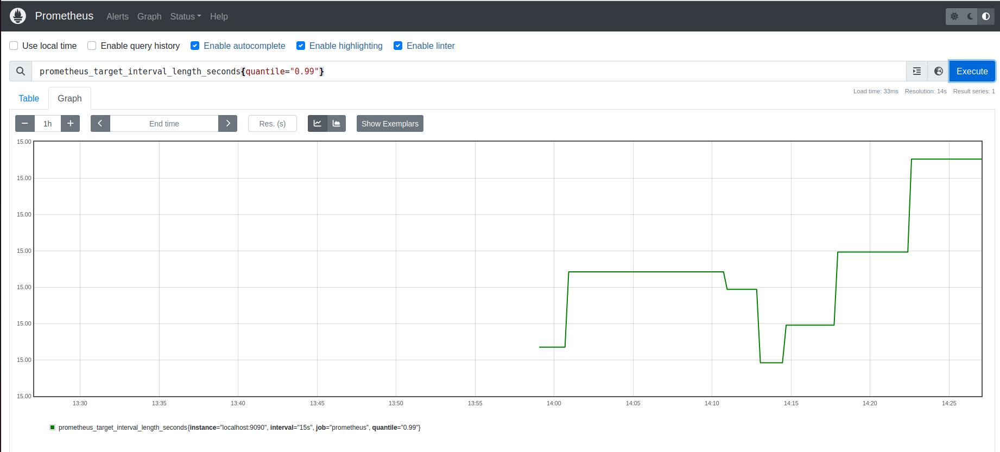
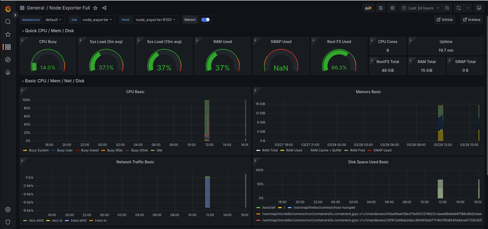

# **Logging- tracing-monitoring-observability**

Ce rapport fait l'objet  de la mise en place et l'utilisation d'outils de journalisation et d'observabilités sur une application Doodle. Pour la réalisation du tutoriel, nous avons fait le choix de suivre un tutoriel sur l'outil Prometheus et un sur grafana.

## Participants
- KONAN David
- LAHOUGUE Lucas 
- LEDET Noémie 
- NYATSIKOR Yawa  
- SENE Albin 

 
## Description du projet utilisé

N'ayant pas manipulé de docker avant ce cours, nous sommes partis de la base d'un projet dockerisé déjà réalisé par Gwendal Jouneaux et Benoît Combemale à l'université de Rennes. 
[Lien du projet doodle utilisé avec documentation](https://github.com/nledet/DevOps)

Ce projet mêle un back et un front permettant l'utilisation d'une plateforme de plannification et de sondage. 

##  Utilisation de Prometheus et Grafana

### Liens utiles pour le suivi de ce tutoriel
[Tutoriel d'utilisation de Prometheus](https://prometheus.io/docs/prometheus/latest/getting_started/)

[Tutoriel Prometheus et Grafana - Christian Lempa](https://www.youtube.com/watch?v=9TJx7QTrTyo)

### Configuration de Prometheus 
Dans notre projet, nous ajoutons un dossier **docker-grafana**, le nom n'est pas important. Dans ce dossier, nous créons un dossier **prometheus**, qui lui ne peut-être modifié car il utilise l'outil prometheus. Dans ce dossier **prometheus** nous créons un fichier **prometheus.yml** contenant le code suivant : 
```
    global:
      scrape_interval: 15s 
    
    scrape_configs:
      - job_name: 'prometheus'
        static_configs:
          - targets: ['localhost:9090']

      - job_name: 'node_exporter'
        static_configs:
          - targets: ['node_exporter:9100']
```
Ce fichier permet la configuration de l'utilisation de prometheus. Nous y retrouvons notamment les intervalles d'executions qui vons nous permettre d'obtenir les courbes lors du monitoring par Grafana. Nous configurons prometheus sur le port *9090* pour nous permettre d'extraire les données. 


Dans le dossier **docker-grafana**, nous créons un fichier **docker-compose.yml**, le nom de ce fichier ne peut être modifié. Nous implémentons le code suivant : 
```
    version: '3'

    volumes:
    prometheus-data:
        driver: local
    grafana-data:
        driver: local

    services:
    prometheus:
        image: prom/prometheus:latest
        container_name: prometheus
        ports:
        - "9090:9090"
        volumes:
        - ./prometheus:/etc/prometheus
        - prometheus-data:/prometheus
        restart: unless-stopped
        command:
        - '--config.file=/etc/prometheus/prometheus.yml'
        - '--storage.tsdb.path=/prometheus'
        - '--storage.tsdb.retention.time=365d'


    grafana:
        image: grafana/grafana:latest
        container_name: grafana
        ports:
        - "6060:3000"
        volumes:
        - grafana-data:/var/lib/grafana
        restart: unless-stopped

    node_exporter:
        image: quay.io/prometheus/node-exporter:latest
        container_name: node_exporter
        command:
        - '--path.rootfs=/host'
        pid: host
        restart: unless-stopped
        volumes:
        - '/:/host:ro,rslave'
```
Nous observons la catégorie volume qui correspond au stockage de nos informations récoltées. La catégorie services permet de configuré les différents outils dont nous aurons besoin. 

### Mise en place de prometheus et grafana
Pour commencer, il faut lancer le projet avec docker, ici nous nous plaçons dans l'API et nous utilisons la commande suivante : 
`sudo docker-compose up -d`

Nous nous plaçons dans **docker-grafana**, et nous réalisons de nouveau la même commande. 

Nous allons maintenant à l'adresse : *http://localhost:9090/*, nous arrivons sur la page de prometheus. 


Ici, nous pouvons observer la représentation graphique de certaines "metrics". 


Pour obtenir une meilleure visualisation, nous utilisons grafana. Pour ouvrir grafana nous ouvrons :*http://localhost:6060/*. Nous arrivons sur la page d'accueil de grafana. Nous choisissons : *add data source -> prometheus*. Nous ajoutons : *http://prometheus:9090/* en tant que source. 


Pour visualiser, nous sélectionnons *import dashboard*. Nous allons sur la page dashboard de grafana et nous recherchons le dashboard *node exporter full*. Nous récupérons son ID soit **1860** et nous le plaçons dans notre import. Nous ajoutons la source : **Prometheus-1** 

## Analyse des résultats
L'affichage offert par Grafana nous permet d'observer les performances de notre projet. Nous pouvons observer l'utilisation du processeur (CPU Buzy). Ainsi, nous pouvons étudier le projet pour voir si des optimisations sont nécessaires. Nous avons également accès à des indicateurs sur la mémoire utilisée : **RAM Used, RAM Total, Memory Basic et Disk Space Used Basic**. En fonction du projet et du suivi que nous souhaitons réaliser, ces données sont plus ou moins importantes.

- **CPU Busy :** Ce premier diagramme nous montre que l'application utilise le processeur 14% du temps depuis son lancement. Le CPU Busy Time correspond à la somme des durées durant lesquelles le processeur exécute des instructions. Nous remarquons également que ce pourcentage reste dans le vert. Nous pouvons dire que notre application n'utilise pas beaucoup le CPU. Nous trouvons cette métrique  très intéressante parce qu'elle nous indique en temps réél la quantité de CPU qu'utilise notre processus et peut nous alerter si ce pourcentage augmente trop voire s'il est dans le rouge afin de rechercher très rapidement d'où vient le problème.
- **Sys Load :** La charge système correspond au % du CPU utilisé par des processus. L'affichage nous donne deux valeurs : **Sys Load (5m avg)** et **Sys Load (5m avg)**. Cela correspond donc à l'utilisation moyenne en pourcentage ces 5 et 15 dernières minutes. Ici, ces valeurs sont de 37,1% (5m) et 37% (15m) ce qui montre que le pourcentage du CPU utilisé au fil du temps ne varie quasiment pas. Notre CPU a 8 coeurs (voir **CPU Cores** en haut à droite de la capture d'écran) ce qui lui permet de répartir les instructions. Si notre CPU avait eu 4 coeurs, les valeurs auraient avoisiné les 74%. Avec 2 coeurs, elles auraient été de presque 150% ce qui aurait donc ralenti les processus.
- **RAM Used :** La RAM est la mémoire vive de notre machine. Ici, on peut voir qu'elle est utilisée à 37% par l'application.
- **SWAP Used :** Le SWAP est l'utilisation d'une partie du disque dur d'une machine pour stocker temporairement des données qui ne sont pas utilisées activement sur la mémoire vive, lorsque celle-ci vient à manquer dans notre machine. Dans notre cas, le SWAP n'est pas utilisé, certainement car il n'y en a pas besoin parce qu'il y a assez de RAM. 
- **Root FS Used :** L'utilisation du Root FS est le pourcentage d'espace disque utilisé par les fichiers et les répertoires situés dans le système de fichiers racine d'une machine. Ici, il est de 66,3%. Il faut faire attention à ce pourcentage car s'il devient plein, il peut devenir impossible d'écrire des fichiers ce qui peut donc empêcher le bon fonctionnement de certains services du système.


 

reste à expliquer :
cup cores (déjà un peu expliqué dans sys load)
uptimes 
rootfs total 
swap total 
cpu basic 
network traffic basic 


